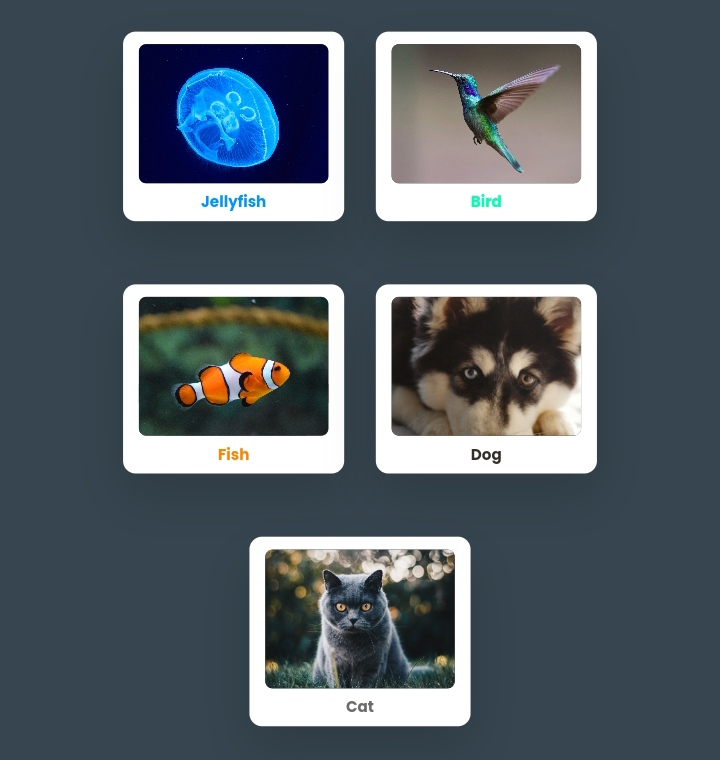

# Responsive Card

A responsive card layout with hover effects. Each card showcases an image and related content that provides an engaging UX.

## Preview



## Live Demo

Check out the live demo [here](https://johndev19.github.io/Responsive-Card/).

## Technologies Used

- HTML
- CSS
- JavaScript

## Getting Started

1. Clone the repository:

   ```bash
   git clone https://github.com/JohnDev19/animated-card.git
   ```

2. Open the `index.html` file in your web browser to view the animated card layout.

## Features

- Responsive design with hover effects.
- Multiple cards with distinct content.

## How to Contribute

I welcome contributions! If you'd like to contribute to this project, follow these steps:

1. Fork the project.
2. Create a new branch: `git checkout -b feature/your-feature-name`.
3. Commit your changes: `git commit -m 'Add some feature'`.
4. Push to the branch: `git push origin feature/your-feature-name`.
5. Submit a pull request.

## License

This project is licensed under the MIT License - see the [LICENSE](LICENSE) file for details.
